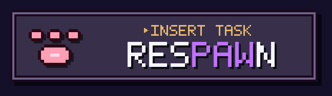

<p align="center">
  
</p>

# RESPAWN

> 9 LIVES · 1 DAY AT A TIME

A pixel-art SNES-inspired quest tracker where completing your daily tasks earns XP, levels up your cat companion, and keeps your streak alive — one life at a time.

---

## Concept

Respawn turns your todo list into a roguelite loop:

- **Quests** have rarity tiers (Common → Urgent) worth 5 to 80 XP
- **Streaks** multiply your XP up to ×2 — break one and you lose a life
- **9 lives** — your cat companion survives that many broken streaks before it's game over
- **Cat companion** evolves across 6 stages (Kitten → Legendary) as you level up, with 8 colour palettes chosen at first login

---

## Stack

| Layer | Tech |
|---|---|
| Frontend | Angular 21 — standalone components, Signals, OnPush |
| Backend | Supabase (PostgreSQL, Auth, RLS) |
| Testing | Vitest via Angular builder |
| Package manager | pnpm |
| Language | TypeScript strict |

**Architecture:** Clean Architecture + Hexagonal. Domain layer is pure TypeScript — zero Angular or Supabase dependencies. Use cases orchestrate domain entities via repository interfaces. Supabase adapters implement those interfaces and are injected via `InjectionToken`.

---

## Roadmap

- **Phase 1 — Solo** *(in progress)*: Auth, quests, XP, levels, streaks, cat companion
- **Phase 2 — Social**: Leaderboard, duels (challenges between players), friends
- **Phase 3 — AI**: Natural language quest parser via Claude API

---

## Getting started

### Prerequisites

- Node.js 20+
- pnpm
- Docker (for local Supabase)

### Install

```bash
pnpm install
```

### Local database

```bash
# Start local Supabase instance (Docker)
pnpm db:start

# Copy env template and fill in the anon key shown by db:start
cp .env.example .env

# Reset DB and apply all migrations
pnpm db:reset
```

### Dev server

```bash
pnpm start
# → http://localhost:4200
```

### Tests

```bash
# All tests
pnpm test

# Specific file
pnpm ng test --include="**/filename.spec.ts" --watch=false
```

### Database scripts

| Script | Description |
|---|---|
| `pnpm db:start` | Start local Supabase (Docker) |
| `pnpm db:stop` | Stop local Supabase |
| `pnpm db:reset` | Drop and recreate DB, replay all migrations |
| `pnpm db:status` | Show local URL and credentials |

---

## Project structure

```
src/
  domain/          # Pure TypeScript — no framework deps
    quest/         # Quest entity, XP calculation, rarity
    profile/       # UserProfile, Streak, level progression, cat stages
  application/     # Use cases (CompleteQuest, CreateQuest, GetUserDashboard)
  infrastructure/  # Supabase adapters (repositories, auth service)
  app/
    core/          # DI tokens, auth guard
    shared/        # Pixel UI components (PixelButton, CatSprite, XpBar…)
    features/      # Auth, Quests, Dashboard screens
supabase/
  migrations/      # PostgreSQL schema + RLS policies
```

---

## Contributing

### Branch strategy

```
main      ← production, protected — PR required, no direct push
develop   ← integration — merge features/fixes here first
feat/*    ← new features  (e.g. feat/42-leaderboard)
fix/*     ← bug fixes     (e.g. fix/17-rls-grant)
docs/*    ← documentation
chore/*   ← tooling, deps, CI
```

**Flow:** branch off `develop` → open PR → merge to `develop` → PR `develop` → `main` to deploy.

Commit messages follow [Conventional Commits](https://www.conventionalcommits.org): `feat:`, `fix:`, `chore:`, `refactor:`, `docs:`, `test:`.

---

## XP system

| Rarity | Base XP | CSS class |
|---|---|---|
| Common | 5 | `.rarity-low` |
| Medium | 15 | `.rarity-med` |
| High | 35 | `.rarity-hi` |
| Urgent | 80 | `.rarity-urg` |

Streak bonus: **+10 % per day**, capped at **+100 %** (≥ 10 days).

## Level thresholds

| Level | XP required |
|---|---|
| 1 | 0 |
| 2 | 100 |
| 3 | 250 |
| 4 | 500 |
| 5 | 1 000 |
| n ≥ 6 | n² × 40 |

## Cat stages

| Stage | Levels |
|---|---|
| Kitten | 1 – 3 |
| Stray | 4 – 7 |
| Ninja | 8 – 12 |
| Samurai | 13 – 18 |
| Arcane | 19 – 25 |
| Legendary | 26+ |
