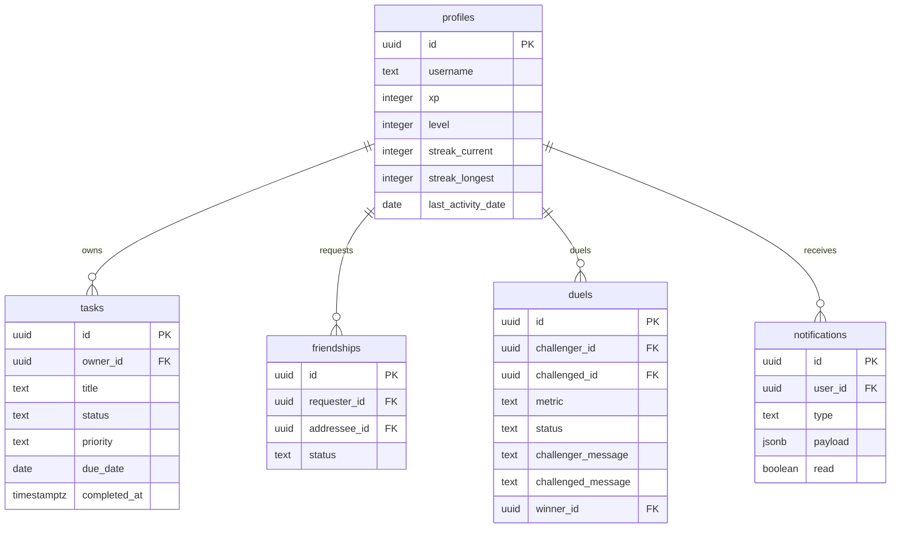
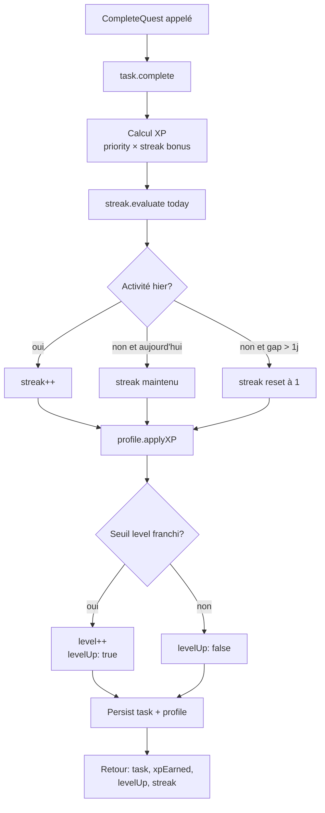
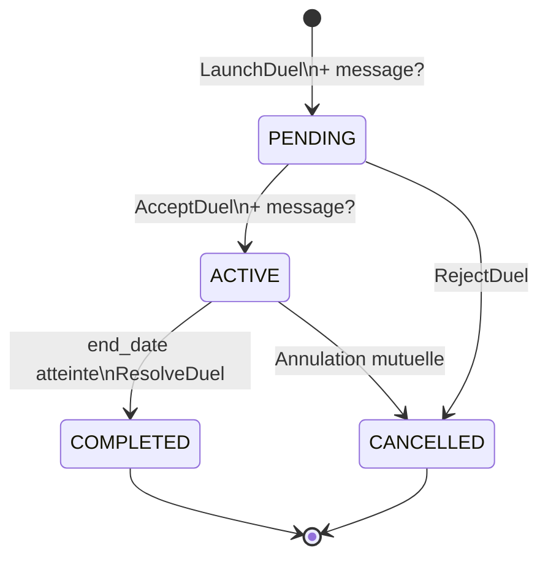

# Respawn — Design Document

**Date:** 2026-05-17  
**Status:** Approved  
**Stack:** Angular + Supabase + TypeScript  
**Tagline:** 9 LIVES · 1 DAY AT A TIME  
**Design export:** `design-export/respawn/project/design_handoff_respawn/`

---

## Vision

Respawn est une application de gestion d'objectifs gamifiée. Chaque jour, l'utilisateur "respawn" — il relance sa run, affronte ses défis, accumule de l'XP et maintient son streak. Les quêtes ne sont pas une liste à cocher : ce sont des combats à mener. Les amis ne sont pas des contacts : ce sont des rivaux et alliés dans un classement commun.

**Vocabulaire définitif (issu du design) :**
- Tâches → **Quests**
- Défis → **Duels**
- Priorités → raretés : `low` (Common) / `med` (Uncommon) / `hi` (Rare) / `urg` (Epic)

**Périmètre v1 :** desktop-first, largeur minimale ~1100px. Pas de mobile en phase 1.

---

## Phases d'implémentation

| Phase | Contenu | Livrable |
|-------|---------|----------|
| 1 | Auth + Quests + XP/Levels/Streaks | App solo gamifiée |
| 2 | Leaderboard + Duels + Amis | Couche sociale complète |
| 3 | AI Quest Parser (Claude API) | Création de quêtes assistée |

---

## Architecture globale

Clean Architecture + Feature Modules Angular. Les dépendances pointent toujours vers l'intérieur.

```
┌─────────────────────────────────────────┐
│         Presentation (Angular)          │
│   feature modules, components, signals  │
├─────────────────────────────────────────┤
│             Infrastructure              │
│   Supabase repos, realtime, auth        │
├─────────────────────────────────────────┤
│              Application                │
│   use cases (CompleteQuest, ComputeXP…)  │
├─────────────────────────────────────────┤
│               Domain                    │
│   entités TS pures, aucune dépendance   │
└─────────────────────────────────────────┘
```

**Règle absolue :** le domain ne connaît ni Angular ni Supabase. Supabase est un détail d'infrastructure branché via des interfaces (ports).

---

## Structure de dossiers

```
src/
  domain/
    task/
      task.entity.ts
      task-status.value-object.ts
      task-priority.value-object.ts
      xp-reward.value-object.ts
      task.repository.ts              ← interface (port)
    profile/
      user-profile.entity.ts
      streak.entity.ts
      profile.repository.ts
    challenge/
      challenge.entity.ts
      challenge-metric.value-object.ts
      challenge.repository.ts
    friendship/
      friendship.entity.ts
      friendship.repository.ts
    notification/
      notification.entity.ts
      notification.repository.ts

  application/
    create-task.use-case.ts
    complete-task.use-case.ts
    get-user-dashboard.use-case.ts
    parse-task-from-text.use-case.ts  ← phase 3
    launch-challenge.use-case.ts
    accept-challenge.use-case.ts
    resolve-challenge.use-case.ts
    get-leaderboard.use-case.ts
    send-friend-request.use-case.ts
    accept-friend-request.use-case.ts

  infrastructure/
    supabase/
      task.repository.ts
      profile.repository.ts
      challenge.repository.ts
      friendship.repository.ts
      notification.repository.ts
      supabase.client.ts
    auth/
      supabase-auth.adapter.ts
    ai/
      claude-task-parser.ts           ← phase 3, implémente IQuestParser

  app/
    core/
      auth.guard.ts
      di-tokens.ts
    shared/
      ui/                             ← composants réutilisables
    features/
      auth/                           ← lazy loaded
      tasks/
      gamification/
      social/
```

---

## Domain layer

### Entités

#### Quest
```typescript
class Quest {
  id: string
  ownerId: string
  title: string
  description?: string
  status: QuestStatus        // TODO | IN_PROGRESS | DONE
  priority: QuestPriority    // LOW | MEDIUM | HIGH | URGENT
  dueDate?: Date
  completedAt?: Date
  createdAt: Date

  complete(): { task: Quest; xpEarned: number }
}
```

#### UserProfile
```typescript
class UserProfile {
  userId: string
  username: string
  avatarUrl?: string
  xp: number
  level: number
  streak: Streak
  createdAt: Date

  applyXP(amount: number): { profile: UserProfile; levelUp: boolean }
}
```

#### Streak
```typescript
class Streak {
  current: number         // jours consécutifs actifs
  longest: number         // record personnel
  lastActivityDate?: Date

  evaluate(today: Date): Streak
}
```

#### Duel
```typescript
class Duel {
  id: string
  challengerId: string
  challengedId: string
  title: string
  metric: DuelMetric   // TASKS_COMPLETED | XP_EARNED
  startDate: Date
  endDate: Date
  status: DuelStatus   // PENDING | ACTIVE | COMPLETED | CANCELLED
  challengerMessage?: string
  challengedMessage?: string
  winnerId?: string

  isExpired(today: Date): boolean
  resolveWinner(challengerScore: number, challengedScore: number): Duel
}
```

### Barème XP (issu du design)

| Rareté | Label | XP de base |
|--------|-------|-----------|
| `low`  | Common   | 5 XP  |
| `med`  | Uncommon | 15 XP |
| `hi`   | Rare     | 35 XP |
| `urg`  | Epic     | 80 XP |

**Streak bonus :** +10% par jour de streak consécutif, plafonné à +100% (streak ≥ 10 jours).

### Seuils de level

| Level | XP requis |
|-------|-----------|
| 1     | 0         |
| 2     | 100       |
| 3     | 250       |
| 4     | 500       |
| 5     | 1 000     |
| N     | N² × 40   |

### Interfaces repository (ports)

```typescript
interface IQuestRepository {
  findByUser(userId: string): Promise<Quest[]>
  findById(id: string): Promise<Quest | null>
  save(task: Quest): Promise<Quest>
}

interface IUserProfileRepository {
  findById(userId: string): Promise<UserProfile | null>
  save(profile: UserProfile): Promise<UserProfile>
  findFriendsLeaderboard(userId: string, period: 'week' | 'month' | 'all'): Promise<UserProfile[]>
}

interface IDuelRepository {
  findActive(userId: string): Promise<Duel[]>
  findById(id: string): Promise<Duel | null>
  save(challenge: Duel): Promise<Duel>
}

interface IFriendshipRepository {
  findAccepted(userId: string): Promise<Friendship[]>
  findPending(userId: string): Promise<Friendship[]>
  save(friendship: Friendship): Promise<Friendship>
}

interface INotificationRepository {
  findUnread(userId: string): Promise<Notification[]>
  markRead(id: string): Promise<void>
  save(notification: Notification): Promise<Notification>
}

interface IQuestParser {
  parse(text: string): Promise<QuestDraft>
}
```

---

## Design System

Référence complète : `design-export/respawn/project/design_handoff_respawn/styles.css`

### Tokens couleurs (oklch)
```
--bg-void:    oklch(0.13 0.035 285)   /* fond page */
--bg-deep:    oklch(0.17 0.04 285)    /* nav + rail */
--bg-panel:   oklch(0.22 0.05 285)    /* modales */
--bg-card:    oklch(0.27 0.05 285)    /* cartes */
--bg-card-hi: oklch(0.32 0.055 285)   /* hover/highlight */

--acc-purple: oklch(0.65 0.22 305)    /* CTA principal, nav active */
--acc-teal:   oklch(0.78 0.16 195)    /* CTA secondaire, "+ New Quest" */
--acc-amber:  oklch(0.82 0.16 75)     /* XP, gold, streaks */
--acc-rose:   oklch(0.7 0.22 18)      /* vies (cœurs) */
--acc-green:  oklch(0.78 0.18 145)    /* succès, "winning" */

--acc-rarity-low: oklch(0.7 0.04 240)
--acc-rarity-med: oklch(0.75 0.18 145)
--acc-rarity-hi:  oklch(0.7 0.2 260)
--acc-rarity-urg: oklch(0.78 0.2 35)
```

### Typographie
- **Press Start 2P** — titres, valeurs de stats, badges de rareté, boutons. Toujours uppercase.
- **VT323** — corps de texte, titres de quêtes, usernames. 16–24px.
- **Silkscreen** — labels, captions, métadonnées. 9–12px, all caps.

### Composants UI clés
- `.pbox` — carte avec double border via `box-shadow`, 0 border-radius
- `.pbtn` — bouton SNES (top highlight + bottom shadow inset + hard drop shadow)
- `.pprog` — barre XP segmentée amber, transition `steps(20)` 
- `.notch-corners` — coins écrêtés pixel via `clip-path`
- `.pinput` — input sombre avec inset border teal au focus
- `.scanlines` / `.vignette` — effets CRT optionnels

### Animations — toujours `steps(N)`, jamais d'easing smooth
- `idle-bob-slow` 2.4s — bob vertical du chat compagnon
- `pop-in` 280–400ms — entrée des modales et révélations level-up
- `flag-shake` 0.3s — bannière "LEVEL UP!"
- `flash` 200–700ms — flash blanc lors de l'évolution du chat

### Système chat compagnon

**Palette (choisie à l'onboarding, immuable) :**
`orange` · `black` · `slate` · `white` · `brown` · `siamese` · `calico` · `void`

**Stades (dérivés du level, jamais stockés) :**
| Stade | Levels | Identité |
|-------|--------|----------|
| Kitten    | 1–3  | Petite tête, grands yeux, pas de corps |
| Stray     | 4–7  | Chat adulte ordinaire |
| Ninja     | 8–12 | Bandeau rouge + masque noir |
| Samurai   | 13–18| Hachimaki blanc, armure, katana |
| Arcane    | 19–25| Chapeau de mage, orbe cyan flottant |
| Legendary | 26+  | Couronne dorée, étincelles cosmiques |

Sprites encodés en grilles de strings dans `sprites.jsx`. Implémentation Angular : reproduire le rendu pixel-div ou exporter en PNG via un pipeline de sprites.

---

## Application layer — Use cases

### CompleteQuest (phase 1 — critique)

```
Input : questId, userId, today: Date
1. questRepo.findById(questId)
2. quest.complete()                      → xpEarned (rareté × streak bonus)
3. profileRepo.findById(userId)
4. streak.evaluate(today)                → maintient / incrémente / reset
5. profile.applyXP(xpEarned)            → recalcule level si seuil franchi
6. questRepo.save(quest)
7. profileRepo.save(profile)
Output : { quest, xpEarned, levelUp: boolean, newLevel?: number, streak }
```

Ce retour riche alimente : toast XP (1.2s), level-up takeover si `levelUp: true`.

### GetUserDashboard (phase 1)
Agrège quêtes du jour + profil XP/level/streak/lives en une seule passe.

### LaunchDuel (phase 2)
Crée un duel PENDING avec message optionnel, notifie l'adversaire.

### AcceptDuel (phase 2)
Passe le duel à ACTIVE, enregistre le message de réponse optionnel.

### ResolveDuel (phase 2)
Appelé par edge function Supabase à `end_date` — calcule les scores et désigne le winner.

### ParseQuestFromText (phase 3)
Délègue à `IQuestParser`. En phase 1 : règles locales (mots-clés → rareté). En phase 3 : Claude API.

---

## Base de données (Supabase)

### Schéma

```sql
-- Profils (étend auth.users)
CREATE TABLE profiles (
  id               UUID PRIMARY KEY REFERENCES auth.users(id),
  username         TEXT UNIQUE NOT NULL,
  avatar_url       TEXT,
  xp               INTEGER DEFAULT 0,
  level            INTEGER DEFAULT 1,
  streak_current   INTEGER DEFAULT 0,
  streak_longest   INTEGER DEFAULT 0,
  last_activity_date DATE,
  created_at       TIMESTAMPTZ DEFAULT NOW()
);

-- Tâches
CREATE TABLE tasks (
  id           UUID PRIMARY KEY DEFAULT gen_random_uuid(),
  owner_id     UUID NOT NULL REFERENCES profiles(id),
  title        TEXT NOT NULL,
  description  TEXT,
  status       TEXT NOT NULL DEFAULT 'todo' CHECK (status IN ('todo','in_progress','done')),
  priority     TEXT NOT NULL DEFAULT 'medium' CHECK (priority IN ('low','medium','high','urgent')),
  due_date     DATE,
  completed_at TIMESTAMPTZ,
  created_at   TIMESTAMPTZ DEFAULT NOW()
);

-- Amitiés
CREATE TABLE friendships (
  id            UUID PRIMARY KEY DEFAULT gen_random_uuid(),
  requester_id  UUID NOT NULL REFERENCES profiles(id),
  addressee_id  UUID NOT NULL REFERENCES profiles(id),
  status        TEXT NOT NULL DEFAULT 'pending' CHECK (status IN ('pending','accepted','rejected')),
  created_at    TIMESTAMPTZ DEFAULT NOW(),
  UNIQUE(requester_id, addressee_id)
);

-- Défis
CREATE TABLE duels (
  id                  UUID PRIMARY KEY DEFAULT gen_random_uuid(),
  challenger_id       UUID NOT NULL REFERENCES profiles(id),
  challenged_id       UUID NOT NULL REFERENCES profiles(id),
  title               TEXT NOT NULL,
  metric              TEXT NOT NULL CHECK (metric IN ('tasks_completed','xp_earned')),
  start_date          DATE NOT NULL,
  end_date            DATE NOT NULL,
  status              TEXT NOT NULL DEFAULT 'pending' CHECK (status IN ('pending','active','completed','cancelled')),
  challenger_message  TEXT,
  challenged_message  TEXT,
  winner_id           UUID REFERENCES profiles(id),
  created_at          TIMESTAMPTZ DEFAULT NOW()
);

-- Notifications
CREATE TABLE notifications (
  id         UUID PRIMARY KEY DEFAULT gen_random_uuid(),
  user_id    UUID NOT NULL REFERENCES profiles(id),
  type       TEXT NOT NULL CHECK (type IN ('friend_request','challenge_received','challenge_result','level_up')),
  payload    JSONB DEFAULT '{}',
  read       BOOLEAN DEFAULT FALSE,
  created_at TIMESTAMPTZ DEFAULT NOW()
);
```

### RLS

```sql
-- profiles : lecture publique, écriture sur son propre profil
ALTER TABLE profiles ENABLE ROW LEVEL SECURITY;
CREATE POLICY "profiles_select" ON profiles FOR SELECT TO authenticated USING (true);
CREATE POLICY "profiles_update" ON profiles FOR UPDATE TO authenticated
  USING (id = (SELECT auth.uid()));

-- tasks : CRUD uniquement sur ses propres tâches
ALTER TABLE tasks ENABLE ROW LEVEL SECURITY;
CREATE POLICY "tasks_all" ON tasks TO authenticated
  USING (owner_id = (SELECT auth.uid()))
  WITH CHECK (owner_id = (SELECT auth.uid()));

-- friendships : visible si participant
ALTER TABLE friendships ENABLE ROW LEVEL SECURITY;
CREATE POLICY "friendships_select" ON friendships FOR SELECT TO authenticated
  USING (requester_id = (SELECT auth.uid()) OR addressee_id = (SELECT auth.uid()));
CREATE POLICY "friendships_insert" ON friendships FOR INSERT TO authenticated
  WITH CHECK (requester_id = (SELECT auth.uid()));
CREATE POLICY "friendships_update" ON friendships FOR UPDATE TO authenticated
  USING (addressee_id = (SELECT auth.uid()));

-- duels : visible si participant, créable uniquement en tant que challenger
ALTER TABLE duels ENABLE ROW LEVEL SECURITY;
CREATE POLICY "duels_select" ON duels FOR SELECT TO authenticated
  USING (challenger_id = (SELECT auth.uid()) OR challenged_id = (SELECT auth.uid()));
CREATE POLICY "duels_insert" ON duels FOR INSERT TO authenticated
  WITH CHECK (challenger_id = (SELECT auth.uid()));
CREATE POLICY "duels_update" ON duels FOR UPDATE TO authenticated
  USING (challenger_id = (SELECT auth.uid()) OR challenged_id = (SELECT auth.uid()));

-- notifications : uniquement les siennes
ALTER TABLE notifications ENABLE ROW LEVEL SECURITY;
CREATE POLICY "notifications_all" ON notifications TO authenticated
  USING (user_id = (SELECT auth.uid()))
  WITH CHECK (user_id = (SELECT auth.uid()));
```

**Realtime** activé uniquement sur `notifications`.

---

## Social features

### Leaderboard
Classement des amis par XP sur 3 périodes (semaine / mois / all-time). Rafraîchi à chaque visite — pas de temps réel nécessaire. Chaque entrée affiche : username, avatar, level, XP de la période, streak actuel.

### Flow amitié
```
Recherche par username
  → envoi demande (friendship: pending)
  → notification in-app → acceptation ou refus
  → si accepté : apparaît dans le leaderboard
```

### Flow challenge
```
Duelr : choisit ami + métrique + dates + message?
  → challenge: PENDING
  → notification → adversaire accepte (+ message?) ou refuse
  → si accepté : challenge: ACTIVE
  → à end_date : edge function calcule winner → challenge: COMPLETED
```

---

## Injection de dépendances Angular

```typescript
// core/di-tokens.ts
export const TASK_REPOSITORY      = new InjectionToken<IQuestRepository>('QuestRepository')
export const PROFILE_REPOSITORY   = new InjectionToken<IUserProfileRepository>('ProfileRepository')
export const CHALLENGE_REPOSITORY = new InjectionToken<IDuelRepository>('DuelRepository')
export const TASK_PARSER          = new InjectionToken<IQuestParser>('QuestParser')

// app.config.ts
providers: [
  { provide: TASK_REPOSITORY,      useClass: SupabaseQuestRepository },
  { provide: PROFILE_REPOSITORY,   useClass: SupabaseProfileRepository },
  { provide: CHALLENGE_REPOSITORY, useClass: SupabaseDuelRepository },
  { provide: TASK_PARSER,          useClass: LocalQuestParser },  // phase 3 → ClaudeQuestParser
]
```

---

## Internationalisation (i18n)

**Langue affichée :** français (phase 1 uniquement).  
**Stratégie :** Angular i18n natif (`$localize` + XLIFF) — 0 dépendance externe, suffisant pour le volume de texte de l'app.

**Règle :** aucun texte UI hardcodé dans les templates Angular. Tous les labels, messages d'erreur et copies utilisent `i18n` attribute ou `$localize`.

**Vocabulaire UI en français :**
- Quests → **Quêtes**
- Duels → **Défis**
- Leaderboard → **Classement**
- Streak → **Série**
- Lives → **Vies**
- Level Up → **Niveau supérieur**
- New Quest → **Nouvelle quête**
- Dashboard → **Tableau de bord**

**Note :** le design system (noms de variables CSS, classes, constantes TS) reste en anglais. Seuls les textes affichés à l'utilisateur sont traduits.

---

## GitHub workflow

### Branches
```
main      ← production, protégée
develop   ← intégration continue
feat/X    ← features
fix/X     ← bugfixes
chore/X   ← setup, config, tooling
```

### Issues prévues (dans l'ordre d'implémentation)

**Phase 1**
```
[chore] Setup Angular project + Clean Architecture structure
[chore] Setup Supabase + schéma DB + RLS
[feat] Auth (sign up, sign in, sign out)
[feat] Create & complete task (UX guidée 2 étapes)
[feat] XP + level system
[feat] Streak system
[feat] Dashboard gamification
```

**Phase 2**
```
[feat] Friend requests
[feat] Leaderboard
[feat] Duels (launch + accept + resolve)
[feat] Notifications in-app (realtime)
```

**Phase 3**
```
[feat] AI task parser (Claude API)
```

### Conventions de commit
```
feat(tasks): add complete-task use case
feat(gamification): implement xp reward and level thresholds
chore(infra): setup supabase client and di tokens
fix(streak): reset streak when gap > 1 day
```

---

## Diagrammes

### ERD



### Flow — CompleteQuest



### Flow — Duel lifecycle


